# Tachygraphy Micro-text Analysis And Normalization
<!---
---
title: "Tachygraphy Micro-text Analysis & Normalization"
emoji: "⚡"
colorFrom: "pink"
colorTo: "blue"
sdk: "static"
pinned: false
---
--->

<!-- ---
title: README
emoji: 😻
colorFrom: yellow
colorTo: red
sdk: static
pinned: false
---
 -->
 
<div align="center">
  
<!--  -->

# Tachygraphy Micro-text Analysis & Normalization

*Welcome to the Tachygraphy Micro-text Analysis & Normalization Project. This page outlines our project’s key stages, sources, sample analysis examples, and team information.*

</div>

---

## Dashboard

### Project Stages

1. **Sentiment Polarity Analysis**
2. **Emotion Mood-tag Analysis**
3. **Text Transformation & Normalization**
4. **Stacked all 3 stages with their best models**
5. **Data Correction & Collection**

### Sources & Deployment Links

| **Training Source** | **Kaggle Collections** | **Hugging Face Org** |
| ------------------- | ---------------------- | -------------------- |
| [GitHub @ Tachygraphy Micro-text Analysis & Normalization](https://github.com/ArchismanKarmakar/Tachygraphy-Microtext-Analysis-And-Normalization) | [Kaggle Dataset](https://www.kaggle.com/datasets/archismancoder/dataset-tachygraphy/data?select=Tachygraphy_MicroText-AIO-V3.xlsx) | [Hugging Face @ Tachygraphy Micro-text Normalization](https://huggingface.co/Tachygraphy-Microtext-Normalization-IEMK25) |

| **Deployment Source** | **Streamlit Deployment** | **Hugging Face Space Deployment** |
| --------------------- | ------------------------ | --------------------------------- |
| [GitHub Deployment Repo](https://github.com/ArchismanKarmakar/Tachygraphy-Microtext-Analysis-And-Normalization-Deployment-Source-HuggingFace_Streamlit_JPX14032025) | [Streamlit App](https://tachygraphy-microtext.streamlit.app/) | [Hugging Face Space](https://huggingface.co/spaces/Tachygraphy-Microtext-Normalization-IEMK25/Tachygraphy-Microtext-Analysis-and-Normalization-ArchismanCoder) |

---

## Project Overview

Tachygraphy—originally developed to expedite writing—has evolved over centuries. In the 1990s, it reappeared as micro‑text, driving faster communication on social media with its “Anytime, Anyplace, Anybody, and Anything (4A)” characteristic. This project focuses on the analysis and normalization of micro‑text (the prevalent informal communication today) to improve NLP tasks such as sentiment analysis, emotion detection, and overall text transformation for clear 4A message decoding.

---

## Sample Examples

### Sample Example 1

Below is a Graphviz diagram illustrating a sample analysis:

```dot
digraph {
    graph [bgcolor="white", rankdir=TB, splines=true, nodesep=0.8, ranksep=0.8];
    node [shape=box, style="rounded,filled", fontname="Helvetica", fontsize=9, margin="0.15,0.1"];

    Input [label="Input:\nbruh, floods in Kerala, rescue ops non‑stop 🚁", fillcolor="#ffe6de", fontcolor="#000000"];
    Output [label="Output:\nBrother, the floods in Kerala are severe,\nand rescue operations are ongoing continuously.", fillcolor="#ffe6de", fontcolor="#000000"];
    Sentiment [label="Sentiment:\nNEUTRAL", fillcolor="#ecdeff", fontcolor="black"];

    Anger [label="Anger: 0.080178231", fillcolor="#deffe1", fontcolor="black"];
    Disgust [label="Disgust: 0.015257259", fillcolor="#deffe1", fontcolor="black"];
    Fear [label="Fear: 0.601871967", fillcolor="#deffe1", fontcolor="black"];
    Joy [label="Joy: 0.00410547", fillcolor="#deffe1", fontcolor="black"];
    Neutral [label="Neutral: 0.0341026", fillcolor="#deffe1", fontcolor="black"];
    Sadness [label="Sadness: 0.245294735", fillcolor="#deffe1", fontcolor="black"];
    Surprise [label="Surprise: 0.019189769", fillcolor="#deffe1", fontcolor="black"];

    edge [color="#7a7a7a", penwidth=3];

    Input -> Output;
    Input -> Sentiment;
    Sentiment -> Anger;
    Sentiment -> Disgust;
    Sentiment -> Fear;
    Sentiment -> Joy;
    Sentiment -> Neutral;
    Sentiment -> Sadness;
    Sentiment -> Surprise;
}
```



### Sample Example 2
digraph {
    graph [bgcolor="white", rankdir=TB, splines=true, nodesep=0.8, ranksep=0.8];
    node [shape=box, style="rounded,filled", fontname="Helvetica", fontsize=9, margin="0.15,0.1"];

    Input [label="Input:\nu rlly think all that talk means u tough? lol, when I step up, u ain't gon say sh*t", fillcolor="#ffe6de", fontcolor="black"];
    Output [label="Output:\nyou really think all that talk makes you tough [lol](laughed out loud) when i step up you are not going to say anything", fillcolor="#ffe6de", fontcolor="black"];
    Sentiment [label="Sentiment:\nNEGATIVE", fillcolor="#ecdeff", fontcolor="black"];

    Anger [label="Anger: 0.14403291", fillcolor="#deffe1", fontcolor="black"];
    Disgust [label="Disgust: 0.039282672", fillcolor="#deffe1", fontcolor="black"];
    Fear [label="Fear: 0.014349542", fillcolor="#deffe1", fontcolor="black"];
    Joy [label="Joy: 0.048965044", fillcolor="#deffe1", fontcolor="black"];
    Neutral [label="Neutral: 0.494852662", fillcolor="#deffe1", fontcolor="black"];
    Sadness [label="Sadness: 0.021111647", fillcolor="#deffe1", fontcolor="black"];
    Surprise [label="Surprise: 0.237405464", fillcolor="#deffe1", fontcolor="black"];

    edge [color="#7a7a7a", penwidth=3];

    Input -> Output;
    Input -> Sentiment;
    Sentiment -> Anger;
    Sentiment -> Disgust;
    Sentiment -> Fear;
    Sentiment -> Joy;
    Sentiment ->
::contentReference[oaicite:0]{index=0}
```

